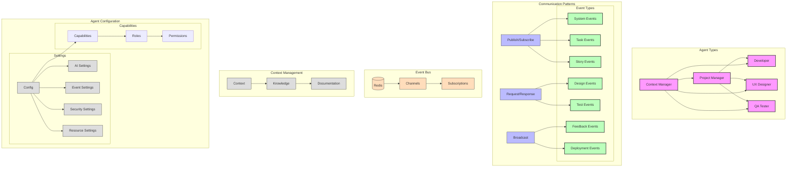

```mermaid
graph TB
    subgraph Agent Types
        PM[Project Manager]
        DEV[Developer]
        UX[UX Designer]
        QA[QA Tester]
        CM[Context Manager]
        
        PM --> DEV
        PM --> UX
        PM --> QA
        CM --> PM
        CM --> DEV
        CM --> UX
        CM --> QA
    end
    
    subgraph Communication Patterns
        PUB[Publish/Subscribe]
        REQ[Request/Response]
        BRD[Broadcast]
        
        subgraph Event Types
            SYS[System Events]
            TSK[Task Events]
            STR[Story Events]
            DSG[Design Events]
            TST[Test Events]
            FDB[Feedback Events]
            DPL[Deployment Events]
        end
        
        PUB --> SYS
        PUB --> TSK
        PUB --> STR
        REQ --> DSG
        REQ --> TST
        BRD --> FDB
        BRD --> DPL
    end
    
    subgraph Event Bus
        RD[(Redis)]
        CH[Channels]
        SUB[Subscriptions]
        
        RD --> CH
        CH --> SUB
    end
    
    subgraph Context Management
        CTX[Context]
        KNW[Knowledge]
        DOC[Documentation]
        
        CTX --> KNW
        KNW --> DOC
    end
    
    subgraph Agent Configuration
        CFG[Config]
        
        subgraph Settings
            AI[AI Settings]
            EVT[Event Settings]
            SEC[Security Settings]
            RES[Resource Settings]
            
            CFG --> AI
            CFG --> EVT
            CFG --> SEC
            CFG --> RES
        end
        
        subgraph Capabilities
            CAP[Capabilities]
            ROL[Roles]
            PRM[Permissions]
            
            CFG --> CAP
            CAP --> ROL
            ROL --> PRM
        end
    end
    
    classDef agent fill:#f9f,stroke:#333,stroke-width:2px
    classDef pattern fill:#bbf,stroke:#333,stroke-width:1px
    classDef event fill:#bfb,stroke:#333,stroke-width:2px
    classDef bus fill:#fdb,stroke:#333,stroke-width:1px
    classDef context fill:#ddd,stroke:#333,stroke-width:1px
    
    class PM,DEV,UX,QA,CM agent
    class PUB,REQ,BRD pattern
    class SYS,TSK,STR,DSG,TST,FDB,DPL event
    class RD,CH,SUB bus
    class CTX,KNW,DOC,CFG,AI,EVT,SEC,RES context
``` 