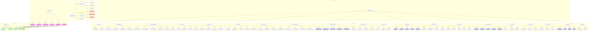

```mermaid
graph TB
    subgraph API Gateway
        AG[API Gateway v1]
    end

    subgraph Authentication
        AR[Auth Router]
        SR[Social Router]
        
        AR --> |POST| AL[Login]
        AR --> |POST| AR1[Refresh]
        AR --> |POST| AV[Verify]
        AR --> |POST| AP[Password Reset]
        
        SR --> |POST| SG[Google Auth]
        SR --> |GET| SC[OAuth Callback]
    end

    subgraph Projects
        PR[Project Router]
        PAR[Agent Router]
        PER[Event Router]
        PTR[Team Router]
        
        PR --> |POST| PC[Create Project]
        PR --> |GET| PL[List Projects]
        PR --> |GET| PG[Get Project]
        PR --> |PUT| PU[Update Project]
        PR --> |DELETE| PD[Delete Project]
        
        PAR --> |POST| PAD[Deploy Agent]
        PAR --> |PATCH| PAS[Scale Agent]
        PAR --> |DELETE| PAR1[Remove Agent]
        
        PER --> |POST| PEC[Create Event]
        PER --> |GET| PEL[List Events]
        PER --> |WS| PEW[WebSocket Events]
        
        PTR --> |POST| PTA[Assign Team]
        PTR --> |GET| PTL[List Teams]
        PTR --> |DELETE| PTR1[Remove Team]
    end

    subgraph Teams
        TR[Team Router]
        TMR[Member Router]
        TRR[Role Router]
        
        TR --> |POST| TC[Create Team]
        TR --> |GET| TL[List Teams]
        TR --> |GET| TG[Get Team]
        TR --> |PUT| TU[Update Team]
        TR --> |DELETE| TD[Delete Team]
        
        TMR --> |POST| TMA[Add Member]
        TMR --> |GET| TML[List Members]
        TMR --> |PUT| TMU[Update Member]
        TMR --> |DELETE| TMD[Remove Member]
        
        TRR --> |POST| TRC[Create Role]
        TRR --> |GET| TRL[List Roles]
        TRR --> |GET| TRG[Get Role]
        TRR --> |PUT| TRU[Update Role]
        TRR --> |DELETE| TRD[Delete Role]
    end

    subgraph Organizations
        OR[Organization Router]
        OMR[Member Router]
        OTR[Team Router]
        
        OR --> |POST| OC[Create Organization]
        OR --> |GET| OL[List Organizations]
        OR --> |GET| OG[Get Organization]
        OR --> |PUT| OU[Update Organization]
        OR --> |DELETE| OD[Delete Organization]
        
        OMR --> |POST| OMA[Add Member]
        OMR --> |GET| OML[List Members]
        OMR --> |PUT| OMU[Update Member]
        OMR --> |DELETE| OMD[Remove Member]
        
        OTR --> |POST| OTA[Assign Team]
        OTR --> |GET| OTL[List Teams]
        OTR --> |DELETE| OTD[Remove Team]
    end

    subgraph Health
        HR[Health Router]
        MR[Metrics Router]
        DR[Dependencies Router]
        
        HR --> |GET| HS[Health Status]
        HR --> |GET| HSS[Service Status]
        HR --> |GET| HRC[Readiness Check]
        HR --> |GET| HLC[Liveness Check]
        
        MR --> |GET| MS[Metrics Summary]
        MR --> |GET| MR1[Resource Metrics]
        MR --> |GET| MSM[Service Metrics]
        MR --> |GET| MP[Prometheus Metrics]
        
        DR --> |GET| DS[Dependencies Status]
        DR --> |GET| DC[Check Dependencies]
        DR --> |GET| DD[Dependency Details]
        DR --> |POST| DV[Verify Dependency]
        DR --> |GET| DCD[Critical Dependencies]
    end

    subgraph Billing
        BR[Billing Router]
        SR1[Subscription Router]
        PMR[Payment Method Router]
        IR[Invoice Router]
        UR[Usage Router]
        
        BR --> |GET| BS[Billing Status]
        BR --> |POST| BW[Webhook Handler]
        
        SR1 --> |POST| SC1[Create Subscription]
        SR1 --> |GET| SL1[List Subscriptions]
        SR1 --> |PUT| SU1[Update Subscription]
        SR1 --> |DELETE| SD1[Cancel Subscription]
        
        PMR --> |POST| PMS[Setup Intent]
        PMR --> |POST| PMA[Add Payment Method]
        PMR --> |GET| PML[List Payment Methods]
        PMR --> |PUT| PMU[Update Payment Method]
        PMR --> |DELETE| PMD[Delete Payment Method]
        
        IR --> |GET| IL[List Invoices]
        IR --> |GET| IU[Upcoming Invoice]
        IR --> |GET| IG[Get Invoice]
        IR --> |POST| IP[Pay Invoice]
        
        UR --> |GET| US[Usage Summary]
        UR --> |GET| UD[Usage Details]
        UR --> |GET| UC[Current Usage]
        UR --> |GET| UF[Usage Forecast]
        UR --> |GET| UL[Usage Limits]
    end

    AG --> AR
    AG --> PR
    AG --> TR
    AG --> OR
    AG --> HR
    AG --> BR

    subgraph Common Patterns
        CP[Common Patterns]
        
        CP --> |Response| CPR[Standard Response]
        CP --> |Error| CPE[Error Handling]
        CP --> |Auth| CPA[Authentication]
        CP --> |Rate| CPL[Rate Limiting]
        
        CPR --> |Success| CPRS[Success Data]
        CPR --> |Error| CPRE[Error Details]
        CPR --> |Meta| CPRM[Metadata]
        
        CPE --> |Validation| CPEV[Validation Errors]
        CPE --> |Business| CPEB[Business Logic Errors]
        CPE --> |System| CPES[System Errors]
    end

    subgraph Services
        S[Services Layer]
        
        S --> |Auth| AS[Auth Service]
        S --> |Project| PS[Project Service]
        S --> |Team| TS[Team Service]
        S --> |Organization| OS[Organization Service]
        S --> |Health| HS1[Health Service]
        S --> |Billing| BS1[Billing Service]
    end

    subgraph Dependencies
        D[Dependencies]
        
        D --> |Database| DB[(Database)]
        D --> |Cache| RD[(Redis)]
        D --> |Events| EB[Event Bus]
        D --> |K8s| K8S[Kubernetes]
        D --> |Stripe| ST[Stripe API]
    end

    AS --> DB
    AS --> RD
    PS --> DB
    PS --> RD
    PS --> EB
    TS --> DB
    TS --> EB
    OS --> DB
    OS --> RD
    OS --> EB
    HS1 --> DB
    HS1 --> RD
    HS1 --> EB
    BS1 --> ST
    BS1 --> DB
    BS1 --> EB

    classDef service fill:#f9f,stroke:#333,stroke-width:2px
    classDef endpoint fill:#bbf,stroke:#333,stroke-width:1px
    classDef dependency fill:#bfb,stroke:#333,stroke-width:2px
    classDef validation fill:#fbb,stroke:#333,stroke-width:1px
    classDef error fill:#ffb,stroke:#333,stroke-width:1px

    class AS,PS,TS,OS,HS1,BS1 service
    class AL,AR1,AV,AP,PC,PL,PG,PU,PD,TC,TL,TG,TU,TD,OC,OL,OG,OU,OD endpoint
    class DB,RD,EB,K8S,ST dependency
    class CPEV,CPEB,CPES validation
    class CPE error
``` 