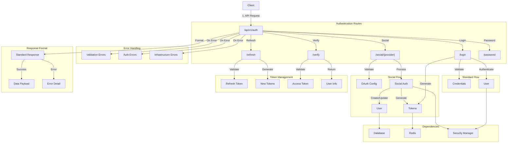

```mermaid
graph TD
    A[Client] -->|1. API Request| B["/api/v1/auth"]
    
    subgraph Authentication Routes
        B -->|Login| C["/login"]
        B -->|Social| D["/social/{provider}"]
        B -->|Refresh| E["/refresh"]
        B -->|Verify| F["/verify"]
        B -->|Password| G["/password"]
    end
    
    subgraph Social Flow
        D -->|Validate| H[OAuth Config]
        D -->|Process| I[Social Auth]
        I -->|Create/Update| J[User]
        I -->|Generate| K[Tokens]
    end
    
    subgraph Standard Flow
        C -->|Validate| L[Credentials]
        C -->|Authenticate| M[User]
        C -->|Generate| K
    end
    
    subgraph Token Management
        E -->|Validate| N[Refresh Token]
        E -->|Generate| O[New Tokens]
        F -->|Validate| P[Access Token]
        F -->|Return| Q[User Info]
    end
    
    subgraph Error Handling
        R[Validation Errors]
        S[Auth Errors]
        T[Infrastructure Errors]
    end
    
    subgraph Response Format
        U[Standard Response]
        U -->|Success| V[Data Payload]
        U -->|Error| W[Error Detail]
    end
    
    B -->|On Error| R
    B -->|On Error| S
    B -->|On Error| T
    
    B -->|Format| U
    
    subgraph Dependencies
        X[Database]
        Y[Redis]
        Z[Security Manager]
    end
    
    J --> X
    K --> Y
    I --> Z
    M --> Z
``` 