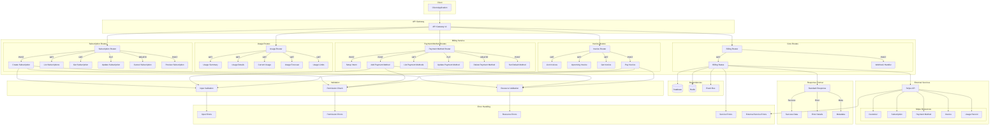

```mermaid
graph TB
    subgraph Client
        C[Client Application]
    end

    subgraph API Gateway
        AG[API Gateway v1]
    end

    subgraph Billing Service
        BR[Billing Router]
        BS[Billing Service]
        SR[Subscription Router]
        PMR[Payment Method Router]
        IR[Invoice Router]
        UR[Usage Router]

        subgraph Subscription Routes
            SR --> |POST| SC[Create Subscription]
            SR --> |GET| SL[List Subscriptions]
            SR --> |GET| SG[Get Subscription]
            SR --> |PUT| SU[Update Subscription]
            SR --> |DELETE| SD[Cancel Subscription]
            SR --> |POST| SP[Preview Subscription]
        end

        subgraph Payment Method Routes
            PMR --> |POST| PMS[Setup Intent]
            PMR --> |POST| PMA[Add Payment Method]
            PMR --> |GET| PML[List Payment Methods]
            PMR --> |PUT| PMU[Update Payment Method]
            PMR --> |DELETE| PMD[Delete Payment Method]
            PMR --> |POST| PMF[Set Default Method]
        end

        subgraph Invoice Routes
            IR --> |GET| IL[List Invoices]
            IR --> |GET| IU[Upcoming Invoice]
            IR --> |GET| IG[Get Invoice]
            IR --> |POST| IP[Pay Invoice]
        end

        subgraph Usage Routes
            UR --> |GET| US[Usage Summary]
            UR --> |GET| UD[Usage Details]
            UR --> |GET| UC[Current Usage]
            UR --> |GET| UF[Usage Forecast]
            UR --> |GET| UL[Usage Limits]
        end

        subgraph Core Routes
            BR --> |GET| BS[Billing Status]
            BR --> |POST| BW[Webhook Handler]
        end
    end

    subgraph External Services
        ST[Stripe API]
        subgraph Stripe Resources
            STC[Customer]
            STS[Subscription]
            STP[Payment Method]
            STI[Invoice]
            STU[Usage Record]
        end
    end

    subgraph Dependencies
        DB[(Database)]
        RD[(Redis)]
        EB[Event Bus]
    end

    C --> AG
    AG --> BR
    AG --> SR
    AG --> PMR
    AG --> IR
    AG --> UR

    BS --> ST
    ST --> STC
    ST --> STS
    ST --> STP
    ST --> STI
    ST --> STU

    BS --> DB
    BS --> RD
    BS --> EB

    subgraph Validation
        V1[Input Validation]
        V2[Permission Check]
        V3[Resource Validation]
    end

    SC --> V1
    SC --> V2
    SC --> V3

    PMA --> V1
    PMA --> V2
    PMA --> V3

    IP --> V1
    IP --> V2
    IP --> V3

    subgraph Error Handling
        E1[Input Errors]
        E2[Permission Errors]
        E3[Resource Errors]
        E4[Service Errors]
        E5[External Service Errors]
    end

    V1 --> E1
    V2 --> E2
    V3 --> E3
    BS --> E4
    ST --> E5

    subgraph Response Format
        RF[Standard Response]
        RF --> |Success| RS[Success Data]
        RF --> |Error| RE[Error Details]
        RF --> |Meta| RM[Metadata]
    end

    BS --> RF
``` 