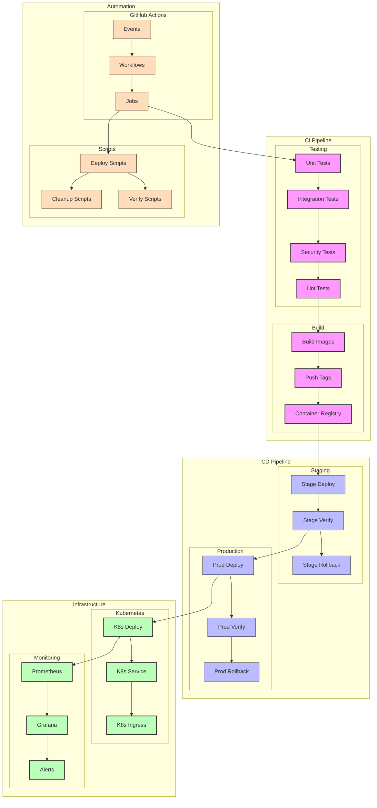

```mermaid
graph TB
    subgraph CI Pipeline
        subgraph Testing
            UT[Unit Tests]
            IT[Integration Tests]
            ST[Security Tests]
            LT[Lint Tests]
            
            UT --> IT
            IT --> ST
            ST --> LT
        end
        
        subgraph Build
            BI[Build Images]
            PT[Push Tags]
            CR[Container Registry]
            
            LT --> BI
            BI --> PT
            PT --> CR
        end
    end
    
    subgraph CD Pipeline
        subgraph Staging
            SD[Stage Deploy]
            SV[Stage Verify]
            SR[Stage Rollback]
            
            CR --> SD
            SD --> SV
            SV --> SR
        end
        
        subgraph Production
            PD[Prod Deploy]
            PV[Prod Verify]
            PR[Prod Rollback]
            
            SV --> PD
            PD --> PV
            PV --> PR
        end
    end
    
    subgraph Infrastructure
        subgraph Kubernetes
            KD[K8s Deploy]
            KS[K8s Service]
            KI[K8s Ingress]
            
            PD --> KD
            KD --> KS
            KS --> KI
        end
        
        subgraph Monitoring
            PM[Prometheus]
            GF[Grafana]
            AL[Alerts]
            
            KD --> PM
            PM --> GF
            GF --> AL
        end
    end
    
    subgraph Automation
        subgraph GitHub Actions
            GW[Workflows]
            GE[Events]
            GJ[Jobs]
            
            GE --> GW
            GW --> GJ
            GJ --> UT
        end
        
        subgraph Scripts
            DS[Deploy Scripts]
            CS[Cleanup Scripts]
            VS[Verify Scripts]
            
            GJ --> DS
            DS --> CS
            DS --> VS
        end
    end
    
    classDef ci fill:#f9f,stroke:#333,stroke-width:2px
    classDef cd fill:#bbf,stroke:#333,stroke-width:1px
    classDef infra fill:#bfb,stroke:#333,stroke-width:2px
    classDef auto fill:#fdb,stroke:#333,stroke-width:1px
    
    class UT,IT,ST,LT,BI,PT,CR ci
    class SD,SV,SR,PD,PV,PR cd
    class KD,KS,KI,PM,GF,AL infra
    class GW,GE,GJ,DS,CS,VS auto
``` 