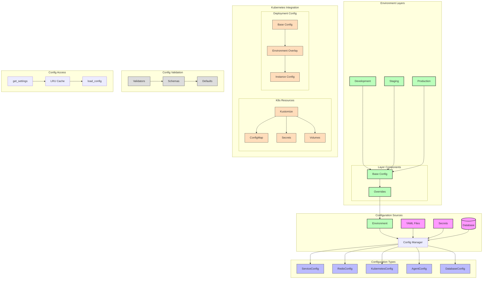

```mermaid
graph TB
    subgraph Configuration Sources
        ENV[Environment Variables]
        YML[YAML Files]
        SEC[Secrets]
        DB[(Database)]
        
        ENV --> CM[Config Manager]
        YML --> CM
        SEC --> CM
        DB --> CM
    end
    
    subgraph Configuration Types
        SC[ServiceConfig]
        RC[RedisConfig]
        KC[KubernetesConfig]
        AC[AgentConfig]
        DC[DatabaseConfig]
        
        CM --> SC
        CM --> RC
        CM --> KC
        CM --> AC
        CM --> DC
    end
    
    subgraph Environment Layers
        DEV[Development]
        STG[Staging]
        PRD[Production]
        
        subgraph Layer Components
            BC[Base Config]
            OV[Overrides]
            ENV[Environment]
            
            BC --> OV
            OV --> ENV
        end
        
        DEV --> BC
        STG --> BC
        PRD --> BC
    end
    
    subgraph Kubernetes Integration
        KS[Kustomize]
        
        subgraph K8s Resources
            CM1[ConfigMap]
            SEC1[Secrets]
            VOL[Volumes]
            
            KS --> CM1
            KS --> SEC1
            KS --> VOL
        end
        
        subgraph Deployment Config
            DC1[Base Config]
            DC2[Environment Overlay]
            DC3[Instance Config]
            
            DC1 --> DC2
            DC2 --> DC3
        end
    end
    
    subgraph Config Validation
        VAL[Validators]
        SCH[Schemas]
        DEF[Defaults]
        
        VAL --> SCH
        SCH --> DEF
    end
    
    subgraph Config Access
        GET[get_settings]
        CACHE[LRU Cache]
        LOAD[load_config]
        
        GET --> CACHE
        CACHE --> LOAD
    end
    
    classDef source fill:#f9f,stroke:#333,stroke-width:2px
    classDef config fill:#bbf,stroke:#333,stroke-width:1px
    classDef env fill:#bfb,stroke:#333,stroke-width:2px
    classDef k8s fill:#fdb,stroke:#333,stroke-width:1px
    classDef validation fill:#ddd,stroke:#333,stroke-width:1px
    
    class ENV,YML,SEC,DB source
    class SC,RC,KC,AC,DC config
    class DEV,STG,PRD,BC,OV,ENV env
    class KS,CM1,SEC1,VOL,DC1,DC2,DC3 k8s
    class VAL,SCH,DEF validation
``` 