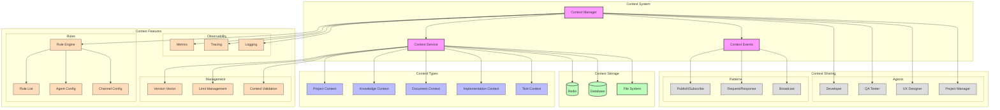

```mermaid
graph TB
    subgraph Context System
        CM[Context Manager]
        CS[Context Service]
        CE[Context Events]
        
        CM --> CS
        CM --> CE
    end
    
    subgraph Context Types
        PC[Project Context]
        KC[Knowledge Context]
        DC[Document Context]
        IC[Implementation Context]
        TC[Test Context]
        
        CS --> PC
        CS --> KC
        CS --> DC
        CS --> IC
        CS --> TC
    end
    
    subgraph Context Storage
        RD[(Redis)]
        DB[(Database)]
        FS[File System]
        
        CS --> RD
        CS --> DB
        CS --> FS
    end
    
    subgraph Context Features
        subgraph Management
            VV[Version Vector]
            LM[Limit Management]
            CV[Context Validation]
            
            CS --> VV
            CS --> LM
            CS --> CV
        end
        
        subgraph Observability
            MT[Metrics]
            TR[Tracing]
            LG[Logging]
            
            CM --> MT
            CM --> TR
            CM --> LG
        end
        
        subgraph Rules
            RE[Rule Engine]
            RL[Rule List]
            AG[Agent Config]
            CH[Channel Config]
            
            CM --> RE
            RE --> RL
            RE --> AG
            RE --> CH
        end
    end
    
    subgraph Context Sharing
        subgraph Agents
            DEV[Developer]
            QA[QA Tester]
            UX[UX Designer]
            PM[Project Manager]
            
            CM --> DEV
            CM --> QA
            CM --> UX
            CM --> PM
        end
        
        subgraph Patterns
            PUB[Publish/Subscribe]
            REQ[Request/Response]
            BRD[Broadcast]
            
            CE --> PUB
            CE --> REQ
            CE --> BRD
        end
    end
    
    classDef system fill:#f9f,stroke:#333,stroke-width:2px
    classDef context fill:#bbf,stroke:#333,stroke-width:1px
    classDef storage fill:#bfb,stroke:#333,stroke-width:2px
    classDef feature fill:#fdb,stroke:#333,stroke-width:1px
    classDef sharing fill:#ddd,stroke:#333,stroke-width:1px
    
    class CM,CS,CE system
    class PC,KC,DC,IC,TC context
    class RD,DB,FS storage
    class VV,LM,CV,MT,TR,LG,RE,RL,AG,CH feature
    class DEV,QA,UX,PM,PUB,REQ,BRD sharing
``` 