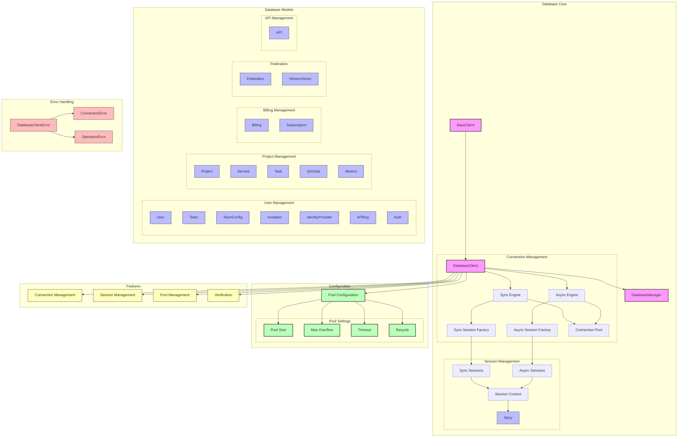

```mermaid
graph TB
    subgraph Database Core
        BC[BaseClient]
        DBC[DatabaseClient]
        DBM[DatabaseManager]
        
        subgraph Connection Management
            SE[Sync Engine]
            AE[Async Engine]
            SF[Sync Session Factory]
            AF[Async Session Factory]
            CP[Connection Pool]
            
            DBC --> SE
            DBC --> AE
            SE --> SF
            AE --> AF
            SE --> CP
            AE --> CP
        end
        
        subgraph Session Management
            SS[Sync Sessions]
            AS[Async Sessions]
            SC[Session Context]
            ST[Session Tracking]
            
            SF --> SS
            AF --> AS
            SS --> SC
            AS --> SC
            SC --> ST
        end
        
        BC --> DBC
        DBC --> DBM
    end
    
    subgraph Database Models
        subgraph User Management
            UM[User]
            TM[Team]
            TC[TeamConfig]
            IN[Invitation]
            IP[IdentityProvider]
            AK[APIKey]
            AU[Auth]
        end
        
        subgraph Project Management
            PR[Project]
            SV[Service]
            ST[Story]
            TS[Task]
            QA[QASuite]
            MT[Metrics]
        end
        
        subgraph Billing Management
            BL[Billing]
            SB[Subscription]
        end
        
        subgraph Federation
            FD[Federation]
            VV[VersionVector]
        end
        
        subgraph API Management
            AM[API]
            AK[APIKey]
        end
    end
    
    subgraph Error Handling
        DBE[DatabaseClientError]
        CNE[ConnectionError]
        OPE[OperationError]
        
        DBE --> CNE
        DBE --> OPE
    end
    
    subgraph Configuration
        PC[Pool Configuration]
        subgraph Pool Settings
            PS1[Pool Size]
            PS2[Max Overflow]
            PS3[Timeout]
            PS4[Recycle]
        end
        
        PC --> PS1
        PC --> PS2
        PC --> PS3
        PC --> PS4
        DBC --> PC
    end
    
    subgraph Features
        CM[Connection Management]
        SM[Session Management]
        PM[Pool Management]
        VM[Verification]
        
        DBC --> CM
        DBC --> SM
        DBC --> PM
        DBC --> VM
    end
    
    classDef core fill:#f9f,stroke:#333,stroke-width:2px
    classDef model fill:#bbf,stroke:#333,stroke-width:1px
    classDef error fill:#fbb,stroke:#333,stroke-width:1px
    classDef config fill:#bfb,stroke:#333,stroke-width:2px
    classDef feature fill:#ffb,stroke:#333,stroke-width:1px
    
    class BC,DBC,DBM core
    class UM,TM,TC,IN,IP,AK,AU,PR,SV,ST,TS,QA,MT,BL,SB,FD,VV,AM,AK model
    class DBE,CNE,OPE error
    class PC,PS1,PS2,PS3,PS4 config
    class CM,SM,PM,VM feature
``` 