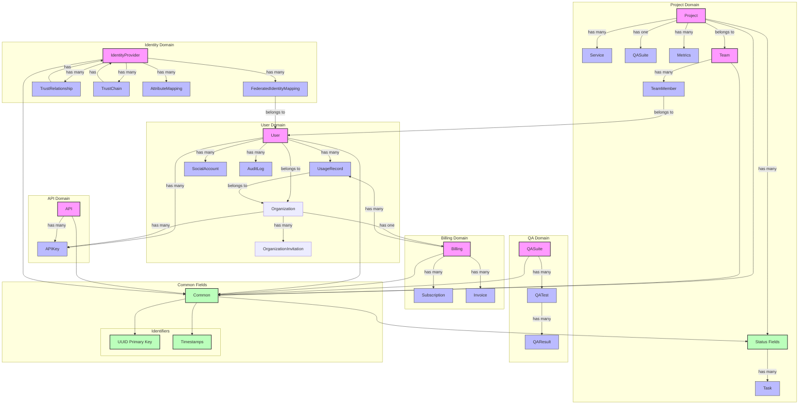

```mermaid
graph TB
    subgraph User Domain
        U[User]
        UR[UserRole]
        SA[SocialAccount]
        AL[AuditLog]
        O[Organization]
        OI[OrganizationInvitation]
        
        U --> |has many| UR
        U --> |has many| SA
        U --> |has many| AL
        U --> |belongs to| O
        UR --> |belongs to| O
        O --> |has many| OI
    end
    
    subgraph Project Domain
        P[Project]
        S[Service]
        ST[Story]
        T[Task]
        QA[QASuite]
        M[Metrics]
        TM[Team]
        TMM[TeamMember]
        
        P --> |has many| S
        P --> |has many| ST
        ST --> |has many| T
        P --> |has one| QA
        P --> |has many| M
        P --> |belongs to| TM
        TM --> |has many| TMM
        TMM --> |belongs to| U
    end
    
    subgraph Identity Domain
        IP[IdentityProvider]
        FIM[FederatedIdentityMapping]
        TR[TrustRelationship]
        TC[TrustChain]
        AM[AttributeMapping]
        
        IP --> |has many| FIM
        IP --> |has many| TR
        IP --> |has many| TC
        IP --> |has many| AM
        FIM --> |belongs to| U
        TR --> |has| IP
        TC --> |has| IP
    end
    
    subgraph Billing Domain
        B[Billing]
        SB[Subscription]
        IN[Invoice]
        UR[UsageRecord]
        
        O --> |has one| B
        B --> |has many| SB
        B --> |has many| IN
        B --> |has many| UR
    end
    
    subgraph API Domain
        API[API]
        AK[APIKey]
        
        API --> |has many| AK
        U --> |has many| AK
        O --> |has many| AK
    end
    
    subgraph QA Domain
        QAS[QASuite]
        QAT[QATest]
        QAR[QAResult]
        
        QAS --> |has many| QAT
        QAT --> |has many| QAR
    end
    
    subgraph Common Fields
        CF[Common]
        
        subgraph Identifiers
            UUID[UUID Primary Key]
            TS[Timestamps]
            ST[Status Fields]
        end
        
        CF --> UUID
        CF --> TS
        CF --> ST
    end
    
    U --> CF
    P --> CF
    TM --> CF
    B --> CF
    API --> CF
    IP --> CF
    QAS --> CF
    
    classDef entity fill:#f9f,stroke:#333,stroke-width:2px
    classDef relation fill:#bbf,stroke:#333,stroke-width:1px
    classDef common fill:#bfb,stroke:#333,stroke-width:2px
    
    class U,P,TM,B,API,IP,QAS entity
    class UR,SA,AL,S,ST,T,QA,M,TMM,FIM,TR,TC,AM,SB,IN,UR,AK,QAT,QAR relation
    class CF,UUID,TS,ST common
``` 