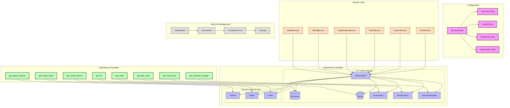

```mermaid
graph TB
    subgraph Configuration
        SC[ServiceConfig]
        SS[SecurityConfig]
        RC[RedisConfig]
        DC[DatabaseConfig]
        KC[KubernetesConfig]
        
        SC --> SS
        SC --> RC
        SC --> DC
        SC --> KC
    end
    
    subgraph Dependency Container
        SD[ServiceDeps]
        
        subgraph Core Dependencies
            DB[(Database)]
            RD[(Redis)]
            K8S[Kubernetes]
            EVT[EventSystem]
            SEC[SecurityManager]
            
            SD --> DB
            SD --> RD
            SD --> K8S
            SD --> EVT
            SD --> SEC
        end
        
        subgraph Service Dependencies
            GH[GitHub]
            STR[Stripe]
            EML[Email]
            
            SD --> GH
            SD --> STR
            SD --> EML
        end
    end
    
    subgraph Dependency Providers
        GDB[get_db]
        GRD[get_redis]
        GK8[get_k8s_client]
        GEV[get_event_bus]
        GSC[get_security_manager]
        GGH[get_github_service]
        GST[get_stripe_client]
        GEM[get_email_service]
        
        GDB --> DB
        GRD --> RD
        GK8 --> K8S
        GEV --> EVT
        GSC --> SEC
        GGH --> GH
        GST --> STR
        GEM --> EML
    end
    
    subgraph Service Layer
        AS[AuthService]
        PS[ProjectService]
        TS[TeamService]
        OS[OrganizationService]
        BS[BillingService]
        HS[HealthService]
        
        AS --> SD
        PS --> SD
        TS --> SD
        OS --> SD
        BS --> SD
        HS --> SD
    end
    
    subgraph Lifecycle Management
        INIT[Initialization]
        CONN[Connection]
        POOL[Connection Pool]
        CLOSE[Cleanup]
        
        INIT --> CONN
        CONN --> POOL
        POOL --> CLOSE
    end
    
    classDef config fill:#f9f,stroke:#333,stroke-width:2px
    classDef container fill:#bbf,stroke:#333,stroke-width:1px
    classDef provider fill:#bfb,stroke:#333,stroke-width:2px
    classDef service fill:#fdb,stroke:#333,stroke-width:1px
    classDef lifecycle fill:#ddd,stroke:#333,stroke-width:1px
    
    class SC,SS,RC,DC,KC config
    class SD,DB,RD,K8S,EVT,SEC,GH,STR,EML container
    class GDB,GRD,GK8,GEV,GSC,GGH,GST,GEM provider
    class AS,PS,TS,OS,BS,HS service
    class INIT,CONN,POOL,CLOSE lifecycle
``` 