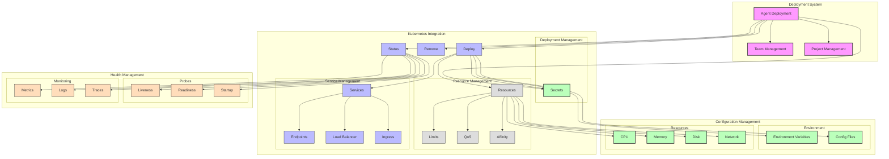

```mermaid
graph TB
    subgraph Deployment System
        AD[Agent Deployment]
        TM[Team Management]
        PM[Project Management]
        
        AD --> TM
        AD --> PM
    end
    
    subgraph Kubernetes Integration
        subgraph Deployment Management
            DP[Deploy]
            SC[Scale]
            RM[Remove]
            ST[Status]
            
            AD --> DP
            AD --> SC
            AD --> RM
            AD --> ST
        end
        
        subgraph Resource Management
            RS[Resources]
            LM[Limits]
            QS[QoS]
            AF[Affinity]
            
            DP --> RS
            RS --> LM
            RS --> QS
            RS --> AF
        end
        
        subgraph Service Management
            SV[Services]
            EP[Endpoints]
            LB[Load Balancer]
            IN[Ingress]
            
            DP --> SV
            SV --> EP
            SV --> LB
            SV --> IN
        end
    end
    
    subgraph Configuration Management
        subgraph Environment
            EV[Environment Variables]
            CF[Config Files]
            SC[Secrets]
            
            DP --> EV
            DP --> CF
            DP --> SC
        end
        
        subgraph Resources
            CPU[CPU]
            MEM[Memory]
            DSK[Disk]
            NET[Network]
            
            RS --> CPU
            RS --> MEM
            RS --> DSK
            RS --> NET
        end
    end
    
    subgraph Health Management
        subgraph Probes
            LP[Liveness]
            RP[Readiness]
            SP[Startup]
            
            ST --> LP
            ST --> RP
            ST --> SP
        end
        
        subgraph Monitoring
            MT[Metrics]
            LG[Logs]
            TR[Traces]
            
            ST --> MT
            ST --> LG
            ST --> TR
        end
    end
    
    classDef system fill:#f9f,stroke:#333,stroke-width:2px
    classDef k8s fill:#bbf,stroke:#333,stroke-width:1px
    classDef config fill:#bfb,stroke:#333,stroke-width:2px
    classDef health fill:#fdb,stroke:#333,stroke-width:1px
    classDef resource fill:#ddd,stroke:#333,stroke-width:1px
    
    class AD,TM,PM system
    class DP,SC,RM,ST,SV,EP,LB,IN k8s
    class EV,CF,SC,CPU,MEM,DSK,NET config
    class LP,RP,SP,MT,LG,TR health
    class RS,LM,QS,AF resource
``` 