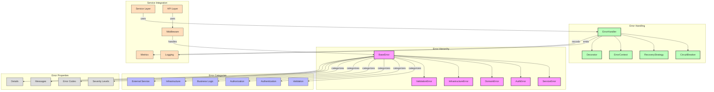

```mermaid
graph TB
    subgraph Error Hierarchy
        BE[BaseError]
        SE[ServiceError]
        AE[AuthError]
        DE[DomainError]
        IE[InfrastructureError]
        VE[ValidationError]
        
        BE --> SE
        BE --> AE
        BE --> DE
        BE --> IE
        BE --> VE
    end
    
    subgraph Error Categories
        VAL[Validation]
        AUTH[Authentication]
        AUTHZ[Authorization]
        BL[Business Logic]
        INF[Infrastructure]
        EXT[External Service]
        
        BE --> |categorizes| VAL
        BE --> |categorizes| AUTH
        BE --> |categorizes| AUTHZ
        BE --> |categorizes| BL
        BE --> |categorizes| INF
        BE --> |categorizes| EXT
    end
    
    subgraph Error Handling
        EH[ErrorHandler]
        CB[CircuitBreaker]
        RS[RecoveryStrategy]
        EC[ErrorContext]
        DEC[Decorator]
        
        EH --> CB
        EH --> RS
        EH --> EC
        EH --> DEC
    end
    
    subgraph Service Integration
        SVC[Service Layer]
        API[API Layer]
        MID[Middleware]
        LOG[Logging]
        MET[Metrics]
        
        SVC --> |uses| EH
        API --> |uses| MID
        MID --> |handles| BE
        EH --> |emits| LOG
        EH --> |records| MET
    end
    
    subgraph Error Properties
        SEV[Severity Levels]
        CODE[Error Codes]
        MSG[Messages]
        DET[Details]
        
        BE --> SEV
        BE --> CODE
        BE --> MSG
        BE --> DET
    end
    
    classDef error fill:#f9f,stroke:#333,stroke-width:2px
    classDef category fill:#bbf,stroke:#333,stroke-width:1px
    classDef handler fill:#bfb,stroke:#333,stroke-width:2px
    classDef integration fill:#fdb,stroke:#333,stroke-width:1px
    classDef property fill:#ddd,stroke:#333,stroke-width:1px
    
    class BE,SE,AE,DE,IE,VE error
    class VAL,AUTH,AUTHZ,BL,INF,EXT category
    class EH,CB,RS,EC,DEC handler
    class SVC,API,MID,LOG,MET integration
    class SEV,CODE,MSG,DET property
``` 