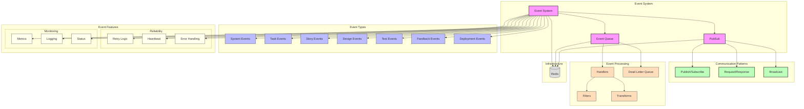

```mermaid
graph TB
    subgraph Event System
        ES[Event System]
        EQ[Event Queue]
        PS[PubSub]
        
        ES --> EQ
        ES --> PS
    end
    
    subgraph Event Types
        SYS[System Events]
        TSK[Task Events]
        STR[Story Events]
        DSG[Design Events]
        TST[Test Events]
        FDB[Feedback Events]
        DPL[Deployment Events]
        
        ES --> SYS
        ES --> TSK
        ES --> STR
        ES --> DSG
        ES --> TST
        ES --> FDB
        ES --> DPL
    end
    
    subgraph Communication Patterns
        PUB[Publish/Subscribe]
        REQ[Request/Response]
        BRD[Broadcast]
        
        PS --> PUB
        PS --> REQ
        PS --> BRD
    end
    
    subgraph Event Processing
        HND[Handlers]
        FLT[Filters]
        TRF[Transforms]
        DLQ[Dead Letter Queue]
        
        EQ --> HND
        HND --> FLT
        HND --> TRF
        EQ --> DLQ
    end
    
    subgraph Infrastructure
        RD[(Redis)]
        
        ES --> RD
        EQ --> RD
        PS --> RD
    end
    
    subgraph Event Features
        subgraph Reliability
            RTY[Retry Logic]
            HB[Heartbeat]
            ERR[Error Handling]
            
            ES --> RTY
            ES --> HB
            ES --> ERR
        end
        
        subgraph Monitoring
            MT[Metrics]
            LOG[Logging]
            ST[Status]
            
            ES --> MT
            ES --> LOG
            ES --> ST
        end
    end
    
    classDef system fill:#f9f,stroke:#333,stroke-width:2px
    classDef event fill:#bbf,stroke:#333,stroke-width:1px
    classDef pattern fill:#bfb,stroke:#333,stroke-width:2px
    classDef processing fill:#fdb,stroke:#333,stroke-width:1px
    classDef infra fill:#ddd,stroke:#333,stroke-width:1px
    classDef feature fill:#ffe,stroke:#333,stroke-width:1px
    
    class ES,EQ,PS system
    class SYS,TSK,STR,DSG,TST,FDB,DPL event
    class PUB,REQ,BRD pattern
    class HND,FLT,TRF,DLQ processing
    class RD infra
    class RTY,HB,ERR,MT,LOG,ST feature
``` 