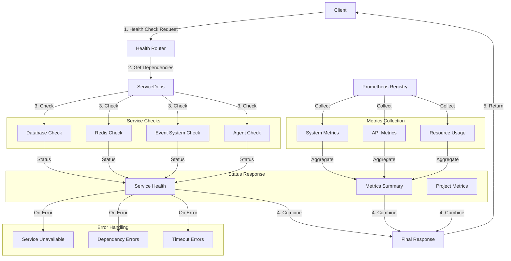

```mermaid
graph TD
    A[Client] -->|1. Health Check Request| B[Health Router]
    B -->|2. Get Dependencies| C[ServiceDeps]
    
    subgraph Service Checks
        D[Database Check]
        E[Redis Check]
        F[Event System Check]
        G[Agent Check]
    end
    
    C -->|3. Check| D
    C -->|3. Check| E
    C -->|3. Check| F
    C -->|3. Check| G
    
    subgraph Metrics Collection
        H[System Metrics]
        I[API Metrics]
        J[Resource Usage]
    end
    
    K[Prometheus Registry] -->|Collect| H
    K -->|Collect| I
    K -->|Collect| J
    
    subgraph Status Response
        L[Service Health]
        M[Metrics Summary]
        N[Project Metrics]
    end
    
    D -->|Status| L
    E -->|Status| L
    F -->|Status| L
    G -->|Status| L
    
    H -->|Aggregate| M
    I -->|Aggregate| M
    J -->|Aggregate| M
    
    subgraph Error Handling
        O[Service Unavailable]
        P[Dependency Errors]
        Q[Timeout Errors]
    end
    
    L -->|On Error| O
    L -->|On Error| P
    L -->|On Error| Q
    
    L -->|4. Combine| R[Final Response]
    M -->|4. Combine| R
    N -->|4. Combine| R
    
    R -->|5. Return| A
``` 