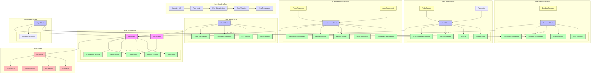

```mermaid
graph TB
    subgraph Base Infrastructure
        BC[BaseClient]
        BCF[BaseConfig]
        
        subgraph Core Features
            RT[Retry Logic]
            MT[Metrics Tracking]
            EH[Error Handling]
            CL[Connection Lifecycle]
            CF[Configuration]
        end
        
        BC --> RT
        BC --> MT
        BC --> EH
        BC --> CL
        BC --> CF
        BCF --> CF
    end
    
    subgraph Database Infrastructure
        DBC[DatabaseClient]
        DBM[DatabaseManager]
        
        subgraph Database Features
            SS[Sync Sessions]
            AS[Async Sessions]
            CM[Connection Management]
            PM[Pool Management]
        end
        
        DBC --> SS
        DBC --> AS
        DBC --> CM
        DBC --> PM
        DBM --> DBC
    end
    
    subgraph Redis Infrastructure
        RC[RedisClient]
        RM[RedisManager]
        RL[RateLimiter]
        
        subgraph Redis Features
            NS[Namespacing]
            PS[PubSub]
            KM[Key Management]
            SM[Size Management]
        end
        
        RC --> NS
        RC --> PS
        RC --> KM
        RC --> SM
        RM --> RC
        RL --> RC
    end
    
    subgraph Kubernetes Infrastructure
        KC[KubernetesClient]
        PR[ProjectResources]
        AD[AgentDeployment]
        
        subgraph K8s Features
            NM[Namespace Management]
            RQ[Resource Quotas]
            NP[Network Policies]
            SA[Service Accounts]
            DM[Deployment Management]
        end
        
        KC --> NM
        KC --> RQ
        KC --> NP
        KC --> SA
        KC --> DM
        PR --> KC
        AD --> KC
    end
    
    subgraph Email Infrastructure
        EC[EmailClient]
        
        subgraph Email Features
            SP[SMTP Provider]
            SE[SES Provider]
            TM[Template Management]
            QM[Queue Management]
        end
        
        EC --> SP
        EC --> SE
        EC --> TM
        EC --> QM
    end
    
    subgraph Stripe Infrastructure
        SC[StripeClient]
        
        subgraph Stripe Features
            PM[Payment Management]
            SM[Subscription Management]
            CM[Customer Management]
            WH[Webhook Handling]
        end
        
        SC --> PM
        SC --> SM
        SC --> CM
        SC --> WH
    end
    
    subgraph Error Types
        BE[BaseError]
        CE[ClientError]
        COE[ConfigError]
        CNE[ConnectionError]
        TE[TimeoutError]
        
        BE --> CE
        BE --> COE
        BE --> CNE
        BE --> TE
    end
    
    subgraph Error Handling Flow
        EHF1[Operation Call]
        EHF2[Retry Logic]
        EHF3[Error Classification]
        EHF4[Error Wrapping]
        EHF5[Error Propagation]
        
        EHF1 --> EHF2
        EHF2 --> EHF3
        EHF3 --> EHF4
        EHF4 --> EHF5
    end
    
    BC --> BE
    DBC --> BC
    RC --> BC
    KC --> BC
    EC --> BC
    SC --> BC

    classDef base fill:#f9f,stroke:#333,stroke-width:2px
    classDef client fill:#bbf,stroke:#333,stroke-width:1px
    classDef feature fill:#bfb,stroke:#333,stroke-width:2px
    classDef error fill:#fbb,stroke:#333,stroke-width:1px
    classDef manager fill:#ffb,stroke:#333,stroke-width:1px
    classDef flow fill:#ddf,stroke:#333,stroke-width:1px

    class BC,BCF base
    class DBC,RC,KC,EC,SC client
    class RT,MT,EH,CL,CF,SS,AS,CM,PM,NS,PS,KM,SM,NM,RQ,NP,SA,DM,SP,SE,TM,QM feature
    class BE,CE,COE,CNE,TE error
    class DBM,RM,PR,AD manager
    class EHF1,EHF2,EHF3,EHF4,EHF5 flow
``` 