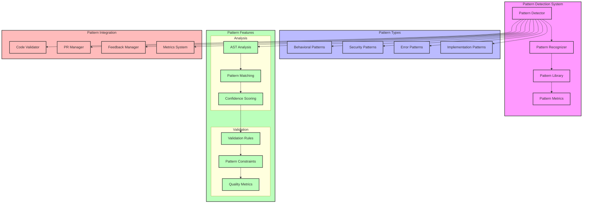
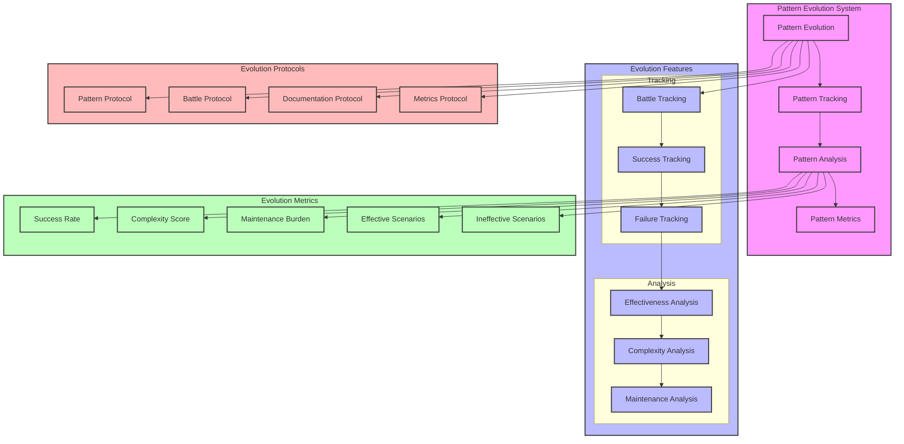
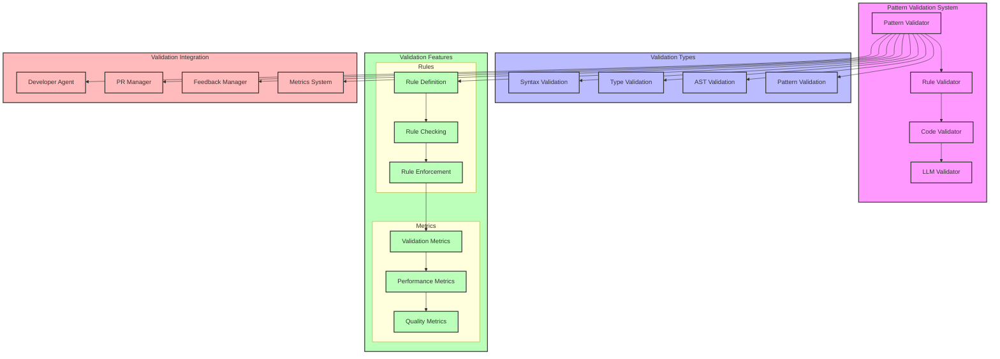
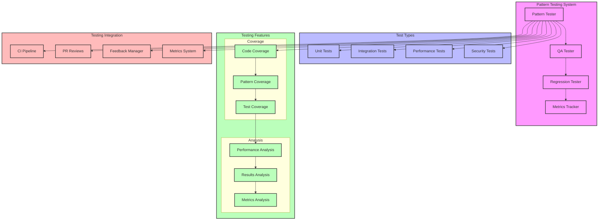

## Pattern Detection System

```mermaid
graph TB
    subgraph PDS[Pattern Detection System]
        PD[Pattern Detector]
        PR[Pattern Recognizer]
        PL[Pattern Library]
        PM[Pattern Metrics]
    end

    subgraph PT[Pattern Types]
        BP[Behavioral Patterns]
        SP[Security Patterns]
        EP[Error Patterns]
        IP[Implementation Patterns]
    end

    subgraph PF[Pattern Features]
        direction LR
        subgraph Analysis
            AST[AST Analysis]
            PM1[Pattern Matching]
            CS[Confidence Scoring]
        end
        subgraph Validation
            VR[Validation Rules]
            PC[Pattern Constraints]
            QM[Quality Metrics]
        end
    end

    subgraph PI[Pattern Integration]
        CV[Code Validator]
        PR1[PR Manager]
        FM[Feedback Manager]
        MS[Metrics System]
    end

    %% Connections
    PD --> PR
    PR --> PL
    PL --> PM

    %% Pattern Types
    PD --> BP
    PD --> SP
    PD --> EP
    PD --> IP

    %% Features
    PD --> AST
    AST --> PM1
    PM1 --> CS
    CS --> VR
    VR --> PC
    PC --> QM

    %% Integration
    PD --> CV
    PD --> PR1
    PD --> FM
    PD --> MS

    style PDS fill:#f9f,stroke:#333,stroke-width:2px
    style PT fill:#bbf,stroke:#333,stroke-width:2px
    style PF fill:#bfb,stroke:#333,stroke-width:2px
    style PI fill:#fbb,stroke:#333,stroke-width:2px

    classDef system fill:#f9f,stroke:#333,stroke-width:2px
    classDef types fill:#bbf,stroke:#333,stroke-width:2px
    classDef features fill:#bfb,stroke:#333,stroke-width:2px
    classDef integration fill:#fbb,stroke:#333,stroke-width:2px

    class PD,PR,PL,PM system
    class BP,SP,EP,IP types
    class AST,PM1,CS,VR,PC,QM features
    class CV,PR1,FM,MS integration
```

## Pattern Evolution System

```mermaid
graph TB
    subgraph PES[Pattern Evolution System]
        PE[Pattern Evolution]
        PT[Pattern Tracking]
        PA[Pattern Analysis]
        PM[Pattern Metrics]
    end

    subgraph EF[Evolution Features]
        direction LR
        subgraph Tracking
            BT[Battle Tracking]
            ST[Success Tracking]
            FT[Failure Tracking]
        end
        subgraph Analysis
            EA[Effectiveness Analysis]
            CA[Complexity Analysis]
            MA[Maintenance Analysis]
        end
    end

    subgraph EM[Evolution Metrics]
        SR[Success Rate]
        CS[Complexity Score]
        MB[Maintenance Burden]
        ES[Effective Scenarios]
        IS[Ineffective Scenarios]
    end

    subgraph EP[Evolution Protocols]
        PP[Pattern Protocol]
        BP[Battle Protocol]
        DP[Documentation Protocol]
        MP[Metrics Protocol]
    end

    %% Connections
    PE --> PT
    PT --> PA
    PA --> PM

    %% Evolution Features
    PE --> BT
    BT --> ST
    ST --> FT
    FT --> EA
    EA --> CA
    CA --> MA

    %% Metrics
    PA --> SR
    PA --> CS
    PA --> MB
    PA --> ES
    PA --> IS

    %% Protocols
    PE --> PP
    PE --> BP
    PE --> DP
    PE --> MP

    style PES fill:#f9f,stroke:#333,stroke-width:2px
    style EF fill:#bbf,stroke:#333,stroke-width:2px
    style EM fill:#bfb,stroke:#333,stroke-width:2px
    style EP fill:#fbb,stroke:#333,stroke-width:2px

    classDef system fill:#f9f,stroke:#333,stroke-width:2px
    classDef features fill:#bbf,stroke:#333,stroke-width:2px
    classDef metrics fill:#bfb,stroke:#333,stroke-width:2px
    classDef protocols fill:#fbb,stroke:#333,stroke-width:2px

    class PE,PT,PA,PM system
    class BT,ST,FT,EA,CA,MA features
    class SR,CS,MB,ES,IS metrics
    class PP,BP,DP,MP protocols
```

## Pattern Validation System

```mermaid
graph TB
    subgraph PVS[Pattern Validation System]
        PV[Pattern Validator]
        RV[Rule Validator]
        CV[Code Validator]
        LV[LLM Validator]
    end

    subgraph VT[Validation Types]
        SV[Syntax Validation]
        TV[Type Validation]
        AV[AST Validation]
        PV1[Pattern Validation]
    end

    subgraph VF[Validation Features]
        direction LR
        subgraph Rules
            RD[Rule Definition]
            RC[Rule Checking]
            RE[Rule Enforcement]
        end
        subgraph Metrics
            VM[Validation Metrics]
            PM[Performance Metrics]
            QM[Quality Metrics]
        end
    end

    subgraph VI[Validation Integration]
        DA[Developer Agent]
        PR[PR Manager]
        FM[Feedback Manager]
        MS[Metrics System]
    end

    %% Connections
    PV --> RV
    RV --> CV
    CV --> LV

    %% Validation Types
    PV --> SV
    PV --> TV
    PV --> AV
    PV --> PV1

    %% Features
    PV --> RD
    RD --> RC
    RC --> RE
    RE --> VM
    VM --> PM
    PM --> QM

    %% Integration
    PV --> DA
    PV --> PR
    PV --> FM
    PV --> MS

    style PVS fill:#f9f,stroke:#333,stroke-width:2px
    style VT fill:#bbf,stroke:#333,stroke-width:2px
    style VF fill:#bfb,stroke:#333,stroke-width:2px
    style VI fill:#fbb,stroke:#333,stroke-width:2px

    classDef system fill:#f9f,stroke:#333,stroke-width:2px
    classDef types fill:#bbf,stroke:#333,stroke-width:2px
    classDef features fill:#bfb,stroke:#333,stroke-width:2px
    classDef integration fill:#fbb,stroke:#333,stroke-width:2px

    class PV,RV,CV,LV system
    class SV,TV,AV,PV1 types
    class RD,RC,RE,VM,PM,QM features
    class DA,PR,FM,MS integration
```

## Pattern Testing System

```mermaid
graph TB
    subgraph PTS[Pattern Testing System]
        PT[Pattern Tester]
        QA[QA Tester]
        RT[Regression Tester]
        MT[Metrics Tracker]
    end

    subgraph TT[Test Types]
        UT[Unit Tests]
        IT[Integration Tests]
        PT1[Performance Tests]
        ST[Security Tests]
    end

    subgraph TF[Testing Features]
        direction LR
        subgraph Coverage
            CC[Code Coverage]
            PC[Pattern Coverage]
            TC[Test Coverage]
        end
        subgraph Analysis
            PA[Performance Analysis]
            RA[Results Analysis]
            MA[Metrics Analysis]
        end
    end

    subgraph TI[Testing Integration]
        CI[CI Pipeline]
        PR[PR Reviews]
        FM[Feedback Manager]
        MS[Metrics System]
    end

    %% Connections
    PT --> QA
    QA --> RT
    RT --> MT

    %% Test Types
    PT --> UT
    PT --> IT
    PT --> PT1
    PT --> ST

    %% Features
    PT --> CC
    CC --> PC
    PC --> TC
    TC --> PA
    PA --> RA
    RA --> MA

    %% Integration
    PT --> CI
    PT --> PR
    PT --> FM
    PT --> MS

    style PTS fill:#f9f,stroke:#333,stroke-width:2px
    style TT fill:#bbf,stroke:#333,stroke-width:2px
    style TF fill:#bfb,stroke:#333,stroke-width:2px
    style TI fill:#fbb,stroke:#333,stroke-width:2px

    classDef system fill:#f9f,stroke:#333,stroke-width:2px
    classDef types fill:#bbf,stroke:#333,stroke-width:2px
    classDef features fill:#bfb,stroke:#333,stroke-width:2px
    classDef integration fill:#fbb,stroke:#333,stroke-width:2px

    class PT,QA,RT,MT system
    class UT,IT,PT1,ST types
    class CC,PC,TC,PA,RA,MA features
    class CI,PR,FM,MS integration
``` 