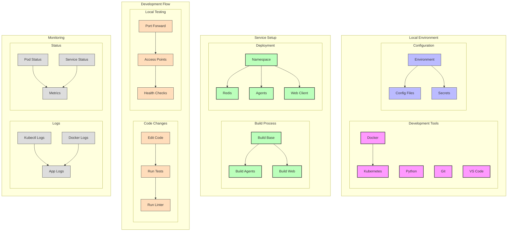

```mermaid
graph TB
    subgraph Local Environment
        subgraph Development Tools
            DK[Docker]
            K8[Kubernetes]
            PY[Python]
            GH[Git]
            VS[VS Code]
            
            DK --> K8
        end
        
        subgraph Configuration
            ENV[Environment]
            CFG[Config Files]
            SEC[Secrets]
            
            ENV --> CFG
            ENV --> SEC
        end
    end
    
    subgraph Service Setup
        subgraph Build Process
            BB[Build Base]
            BA[Build Agents]
            BW[Build Web]
            
            BB --> BA
            BB --> BW
        end
        
        subgraph Deployment
            NS[Namespace]
            RD[Redis]
            AG[Agents]
            WB[Web Client]
            
            NS --> RD
            NS --> AG
            NS --> WB
        end
    end
    
    subgraph Development Flow
        subgraph Code Changes
            ED[Edit Code]
            TS[Run Tests]
            LN[Run Linter]
            
            ED --> TS
            TS --> LN
        end
        
        subgraph Local Testing
            PF[Port Forward]
            AP[Access Points]
            HB[Health Checks]
            
            PF --> AP
            AP --> HB
        end
    end
    
    subgraph Monitoring
        subgraph Logs
            KL[Kubectl Logs]
            DL[Docker Logs]
            AL[App Logs]
            
            KL --> AL
            DL --> AL
        end
        
        subgraph Status
            PS[Pod Status]
            SS[Service Status]
            MS[Metrics]
            
            PS --> MS
            SS --> MS
        end
    end
    
    classDef tools fill:#f9f,stroke:#333,stroke-width:2px
    classDef config fill:#bbf,stroke:#333,stroke-width:1px
    classDef setup fill:#bfb,stroke:#333,stroke-width:2px
    classDef flow fill:#fdb,stroke:#333,stroke-width:1px
    classDef monitor fill:#ddd,stroke:#333,stroke-width:1px
    
    class DK,K8,PY,GH,VS tools
    class ENV,CFG,SEC config
    class BB,BA,BW,NS,RD,AG,WB setup
    class ED,TS,LN,PF,AP,HB flow
    class KL,DL,AL,PS,SS,MS monitor
``` 