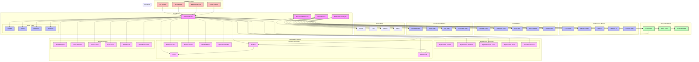

```mermaid
graph TB
    subgraph Core Metrics
        MC[MetricsCollector]
        PA[PerformanceAnalyzer]
        OM[ObservabilityManager]
        MS[MetricsService]

        subgraph Metric Types
            MT1[Counter]
            MT2[Gauge]
            MT3[Histogram]
            MT4[Summary]
        end

        MC --> MT1
        MC --> MT2
        MC --> MT3
        MC --> MT4
    end

    subgraph Performance Metrics
        PM1[CPU Usage]
        PM2[Memory Usage]
        PM3[Disk IO]
        PM4[Network IO]
        PM5[Process Stats]

        PA --> PM1
        PA --> PM2
        PA --> PM3
        PA --> PM4
        PA --> PM5
    end

    subgraph Service Metrics
        SM1[Request Count]
        SM2[Response Time]
        SM3[Error Rate]
        SM4[Success Rate]
        SM5[Active Users]

        MS --> SM1
        MS --> SM2
        MS --> SM3
        MS --> SM4
        MS --> SM5
    end

    subgraph Infrastructure Metrics
        IM1[Database Stats]
        IM2[Redis Stats]
        IM3[K8s Stats]
        IM4[Event Bus Stats]

        MS --> IM1
        MS --> IM2
        MS --> IM3
        MS --> IM4
    end

    subgraph Organization Metrics
        subgraph Organization Operations
            OO1[Organization Created]
            OO2[Organization Retrieved]
            OO3[Organization Not Found]
            OO4[Organization Errors]
            OO5[Operation Duration]
        end

        subgraph Member Operations
            MO1[Member Invited]
            MO2[Member Updated]
            MO3[Member Removed]
            MO4[Members Listed]
            MO5[Member Count]
            MO6[Member Errors]
            MO7[Operation Duration]
        end

        subgraph Team Operations
            TO1[Team Assigned]
            TO2[Team Removed]
            TO3[Teams Listed]
            TO4[Team Count]
            TO5[Team Errors]
            TO6[Operation Duration]
        end

        MC --> OO1
        MC --> OO2
        MC --> OO3
        MC --> OO4
        MC --> OO5
        MC --> MO1
        MC --> MO2
        MC --> MO3
        MC --> MO4
        MC --> MO5
        MC --> MO6
        MC --> MO7
        MC --> TO1
        MC --> TO2
        MC --> TO3
        MC --> TO4
        MC --> TO5
        MC --> TO6
    end

    subgraph Observability
        OB1[Traces]
        OB2[Logs]
        OB3[Metrics]
        OB4[Alerts]

        OM --> OB1
        OM --> OB2
        OM --> OB3
        OM --> OB4
    end

    subgraph Storage Backends
        SB1[Prometheus]
        SB2[Redis Cache]
        SB3[Time Series DB]

        MC --> SB1
        MC --> SB2
        MC --> SB3
    end

    subgraph Integration Points
        IP1[API Routes]
        IP2[Service Layer]
        IP3[Background Jobs]
        IP4[Health Checks]

        IP1 --> MC
        IP2 --> MC
        IP3 --> MC
        IP4 --> MC
    end

    subgraph Monitoring
        MO1[Grafana]
        MO2[Alerts]
        MO3[Dashboards]

        SB1 --> MO1
        MO1 --> MO2
        MO1 --> MO3
    end

    classDef core fill:#f9f,stroke:#333,stroke-width:2px
    classDef metrics fill:#bbf,stroke:#333,stroke-width:1px
    classDef storage fill:#bfb,stroke:#333,stroke-width:2px
    classDef integration fill:#fbb,stroke:#333,stroke-width:1px
    classDef monitoring fill:#ffb,stroke:#333,stroke-width:1px
    classDef organization fill:#fbf,stroke:#333,stroke-width:1px

    class MC,PA,OM,MS core
    class MT1,MT2,MT3,MT4,PM1,PM2,PM3,PM4,PM5,SM1,SM2,SM3,SM4,SM5,IM1,IM2,IM3,IM4 metrics
    class SB1,SB2,SB3 storage
    class IP1,IP2,IP3,IP4 integration
    class MO1,MO2,MO3 monitoring
    class OO1,OO2,OO3,OO4,OO5,MO1,MO2,MO3,MO4,MO5,MO6,MO7,TO1,TO2,TO3,TO4,TO5,TO6 organization
``` 