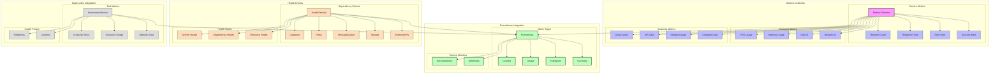

```mermaid
graph TB
    subgraph Metrics Collection
        MC[MetricsCollector]
        
        subgraph Service Metrics
            SM1[Request Count]
            SM2[Response Time]
            SM3[Error Rate]
            SM4[Success Rate]
            
            MC --> SM1
            MC --> SM2
            MC --> SM3
            MC --> SM4
        end
        
        subgraph Resource Metrics
            RM1[CPU Usage]
            RM2[Memory Usage]
            RM3[Disk IO]
            RM4[Network IO]
            
            MC --> RM1
            MC --> RM2
            MC --> RM3
            MC --> RM4
        end
        
        subgraph Business Metrics
            BM1[Active Users]
            BM2[API Calls]
            BM3[Storage Usage]
            BM4[Compute Units]
            
            MC --> BM1
            MC --> BM2
            MC --> BM3
            MC --> BM4
        end
    end
    
    subgraph Prometheus Integration
        PR[Prometheus]
        
        subgraph Metric Types
            CNT[Counter]
            GAU[Gauge]
            HIS[Histogram]
            SUM[Summary]
            
            PR --> CNT
            PR --> GAU
            PR --> HIS
            PR --> SUM
        end
        
        subgraph Service Monitors
            SM[ServiceMonitor]
            AR[AlertRules]
            
            PR --> SM
            PR --> AR
        end
    end
    
    subgraph Health Checks
        HC[HealthService]
        
        subgraph Dependency Checks
            DC1[Database]
            DC2[Redis]
            DC3[MessageQueue]
            DC4[Storage]
            DC5[ExternalAPIs]
            
            HC --> DC1
            HC --> DC2
            HC --> DC3
            HC --> DC4
            HC --> DC5
        end
        
        subgraph Health Status
            HS1[Service Health]
            HS2[Dependency Health]
            HS3[Resource Health]
            
            HC --> HS1
            HC --> HS2
            HC --> HS3
        end
    end
    
    subgraph Kubernetes Integration
        KS[KubernetesService]
        
        subgraph Pod Metrics
            PM1[Container Stats]
            PM2[Resource Usage]
            PM3[Network Stats]
            
            KS --> PM1
            KS --> PM2
            KS --> PM3
        end
        
        subgraph Health Probes
            HP1[Readiness]
            HP2[Liveness]
            
            KS --> HP1
            KS --> HP2
        end
    end
    
    MC --> PR
    HC --> PR
    KS --> PR
    
    classDef collector fill:#f9f,stroke:#333,stroke-width:2px
    classDef metrics fill:#bbf,stroke:#333,stroke-width:1px
    classDef prometheus fill:#bfb,stroke:#333,stroke-width:2px
    classDef health fill:#fdb,stroke:#333,stroke-width:1px
    classDef kubernetes fill:#ddd,stroke:#333,stroke-width:1px
    
    class MC collector
    class SM1,SM2,SM3,SM4,RM1,RM2,RM3,RM4,BM1,BM2,BM3,BM4 metrics
    class PR,CNT,GAU,HIS,SUM,SM,AR prometheus
    class HC,DC1,DC2,DC3,DC4,DC5,HS1,HS2,HS3 health
    class KS,PM1,PM2,PM3,HP1,HP2 kubernetes
``` 