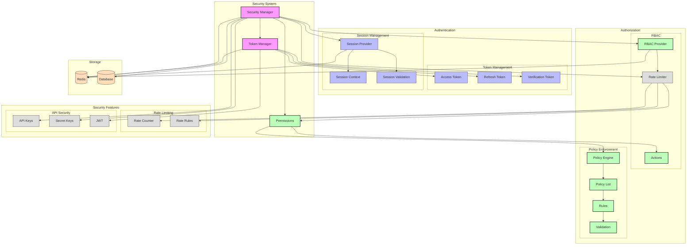

```mermaid
graph TB
    subgraph Security System
        SM[Security Manager]
        TM[Token Manager]
        PM[Policy Manager]
        
        SM --> TM
        SM --> PM
    end
    
    subgraph Authentication
        subgraph Token Management
            AT[Access Token]
            RT[Refresh Token]
            VT[Verification Token]
            
            TM --> AT
            TM --> RT
            TM --> VT
        end
        
        subgraph Session Management
            SP[Session Provider]
            SC[Session Context]
            SV[Session Validation]
            
            SM --> SP
            SP --> SC
            SP --> SV
        end
    end
    
    subgraph Authorization
        subgraph RBAC
            RP[RBAC Provider]
            RL[Roles]
            PM[Permissions]
            AC[Actions]
            
            SM --> RP
            RP --> RL
            RL --> PM
            PM --> AC
        end
        
        subgraph Policy Enforcement
            PE[Policy Engine]
            PL[Policy List]
            RU[Rules]
            VA[Validation]
            
            PM --> PE
            PE --> PL
            PL --> RU
            RU --> VA
        end
    end
    
    subgraph Storage
        RD[(Redis)]
        DB[(Database)]
        
        SM --> RD
        SM --> DB
        TM --> RD
        RP --> RD
        SP --> RD
    end
    
    subgraph Security Features
        subgraph Rate Limiting
            RL[Rate Limiter]
            RC[Rate Counter]
            RR[Rate Rules]
            
            SM --> RL
            RL --> RC
            RL --> RR
        end
        
        subgraph API Security
            AK[API Keys]
            SK[Secret Keys]
            JW[JWT]
            
            SM --> AK
            SM --> SK
            TM --> JW
        end
    end
    
    classDef system fill:#f9f,stroke:#333,stroke-width:2px
    classDef auth fill:#bbf,stroke:#333,stroke-width:1px
    classDef rbac fill:#bfb,stroke:#333,stroke-width:2px
    classDef storage fill:#fdb,stroke:#333,stroke-width:1px
    classDef feature fill:#ddd,stroke:#333,stroke-width:1px
    
    class SM,TM,PM system
    class AT,RT,VT,SP,SC,SV auth
    class RP,RL,PM,AC,PE,PL,RU,VA rbac
    class RD,DB storage
    class RL,RC,RR,AK,SK,JW feature
``` 