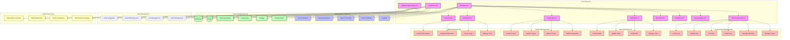

```mermaid
graph TB
    subgraph Core Services
        BS[BaseService]
        AS[AuthService]
        PS[ProjectService]
        TS[TeamService]
        OS[OrganizationService]
        ES[EventService]
        EMS[EmailService]
        MS[MonitoringService]
        BIS[BillingService]
        HS[HealthService]
        TMS[TaskManagementService]

        BS --> AS
        BS --> PS
        BS --> TS
        BS --> OS
        BS --> ES
        BS --> EMS
        BS --> MS
        BS --> BIS
    end

    subgraph Base Service Features
        CB[Circuit Breaker]
        RM[Retry Mechanism]
        MT[Metrics Tracking]
        EH[Error Handling]
        LOG[Logging]

        BS --> CB
        BS --> RM
        BS --> MT
        BS --> EH
        BS --> LOG
    end

    subgraph Service Dependencies
        DB[(Database)]
        RD[(Redis)]
        MQ[Message Queue]
        K8S[Kubernetes]
        ST[Storage]
        EXT[External APIs]

        HS --> DB
        HS --> RD
        HS --> MQ
        HS --> ST
        HS --> EXT
    end

    subgraph Organization Management
        OM1[Create Org]
        OM2[Update Org]
        OM3[List Orgs]
        OM4[Delete Org]
        MM1[Manage Members]
        MM2[Manage Teams]

        OS --> OM1
        OS --> OM2
        OS --> OM3
        OS --> OM4
        OS --> MM1
        OS --> MM2
    end

    subgraph Team Management
        TM1[Create Team]
        TM2[Update Team]
        TM3[Scale Role]
        TM4[Manage Limits]

        TS --> TM1
        TS --> TM2
        TS --> TM3
        TS --> TM4
    end

    subgraph Project Management
        PM1[Create Project]
        PM2[Update Project]
        PM3[Delete Project]
        PM4[GitHub Integration]

        PS --> PM1
        PS --> PM2
        PS --> PM3
        PS --> PM4
    end

    subgraph Billing Management
        BM1[Create Subscription]
        BM2[Update Subscription]
        BM3[Track Usage]
        BM4[Manage Tiers]

        BIS --> BM1
        BIS --> BM2
        BIS --> BM3
        BIS --> BM4
    end

    subgraph Task Management
        TMI[Trello Integration]
        TMB[Board Management]
        TML[List Management]
        TMC[Card Management]

        TMS --> TMI
        TMS --> TMB
        TMS --> TML
        TMS --> TMC
    end

    subgraph Health Monitoring
        HM1[Dependency Checks]
        HM2[Status Reporting]
        HM3[Metrics Collection]
        HM4[Performance Analysis]

        HS --> HM1
        HS --> HM2
        HS --> HM3
        HS --> HM4
    end

    classDef core fill:#f9f,stroke:#333,stroke-width:2px
    classDef feature fill:#bbf,stroke:#333,stroke-width:1px
    classDef dependency fill:#bfb,stroke:#333,stroke-width:2px
    classDef management fill:#fbb,stroke:#333,stroke-width:1px
    classDef monitoring fill:#ffb,stroke:#333,stroke-width:1px

    class BS,AS,PS,TS,OS,ES,EMS,MS,BIS,HS,TMS core
    class CB,RM,MT,EH,LOG feature
    class DB,RD,MQ,K8S,ST,EXT dependency
    class OM1,OM2,OM3,OM4,MM1,MM2,TM1,TM2,TM3,TM4,PM1,PM2,PM3,PM4,BM1,BM2,BM3,BM4 management
    class HM1,HM2,HM3,HM4 monitoring
``` 