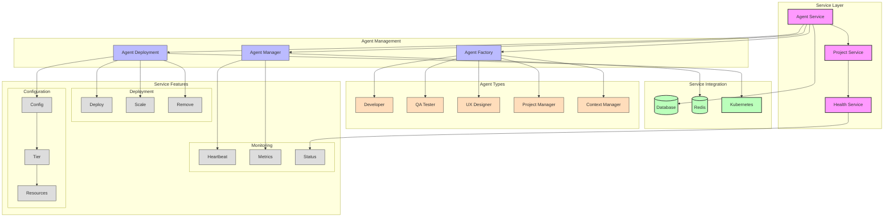

```mermaid
graph TB
    subgraph Service Layer
        AS[Agent Service]
        PS[Project Service]
        HS[Health Service]
        
        AS --> PS
        PS --> HS
    end
    
    subgraph Agent Management
        AD[Agent Deployment]
        AF[Agent Factory]
        AM[Agent Manager]
        
        AS --> AD
        AS --> AF
        AS --> AM
    end
    
    subgraph Service Integration
        DB[(Database)]
        RD[(Redis)]
        K8S[Kubernetes]
        
        AD --> K8S
        AM --> RD
        AS --> DB
    end
    
    subgraph Agent Types
        DEV[Developer]
        QA[QA Tester]
        UX[UX Designer]
        PM[Project Manager]
        CM[Context Manager]
        
        AF --> DEV
        AF --> QA
        AF --> UX
        AF --> PM
        AF --> CM
    end
    
    subgraph Service Features
        subgraph Deployment
            DP[Deploy]
            SC[Scale]
            RM[Remove]
            
            AD --> DP
            AD --> SC
            AD --> RM
        end
        
        subgraph Monitoring
            HB[Heartbeat]
            MT[Metrics]
            ST[Status]
            
            AM --> HB
            AM --> MT
            HS --> ST
        end
        
        subgraph Configuration
            CF[Config]
            TI[Tier]
            RS[Resources]
            
            AD --> CF
            CF --> TI
            TI --> RS
        end
    end
    
    classDef service fill:#f9f,stroke:#333,stroke-width:2px
    classDef management fill:#bbf,stroke:#333,stroke-width:1px
    classDef integration fill:#bfb,stroke:#333,stroke-width:2px
    classDef agent fill:#fdb,stroke:#333,stroke-width:1px
    classDef feature fill:#ddd,stroke:#333,stroke-width:1px
    
    class AS,PS,HS service
    class AD,AF,AM management
    class DB,RD,K8S integration
    class DEV,QA,UX,PM,CM agent
    class DP,SC,RM,HB,MT,ST,CF,TI,RS feature
``` 