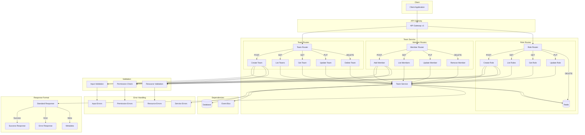

```mermaid
graph TB
    subgraph Client
        C[Client Application]
    end

    subgraph API Gateway
        AG[API Gateway v1]
    end

    subgraph Team Service
        TR[Team Router]
        TS[Team Service]
        MR[Member Router]
        RR[Role Router]

        subgraph Team Routes
            TR --> |POST| TC[Create Team]
            TR --> |GET| TL[List Teams]
            TR --> |GET| TG[Get Team]
            TR --> |PUT| TU[Update Team]
            TR --> |DELETE| TD[Delete Team]
        end

        subgraph Member Routes
            MR --> |POST| MA[Add Member]
            MR --> |GET| ML[List Members]
            MR --> |PUT| MU[Update Member]
            MR --> |DELETE| MD[Remove Member]
        end

        subgraph Role Routes
            RR --> |POST| RC[Create Role]
            RR --> |GET| RL[List Roles]
            RR --> |GET| RG[Get Role]
            RR --> |PUT| RU[Update Role]
            RR --> |DELETE| RD[Delete Role]
        end

        TC --> TS
        TL --> TS
        TG --> TS
        TU --> TS
        TD --> TS

        MA --> TS
        ML --> TS
        MU --> TS
        MD --> TS

        RC --> TS
        RL --> TS
        RG --> TS
        RU --> TS
        RD --> TS
    end

    subgraph Dependencies
        DB[(Database)]
        RD[(Redis)]
        EB[Event Bus]
    end

    C --> AG
    AG --> TR
    AG --> MR
    AG --> RR

    TS --> DB
    TS --> RD
    TS --> EB

    subgraph Validation
        V1[Input Validation]
        V2[Permission Check]
        V3[Resource Validation]
    end

    TC --> V1
    TC --> V2
    TC --> V3

    MA --> V1
    MA --> V2
    MA --> V3

    RC --> V1
    RC --> V2
    RC --> V3

    subgraph Error Handling
        E1[Input Errors]
        E2[Permission Errors]
        E3[Resource Errors]
        E4[Service Errors]
    end

    V1 --> E1
    V2 --> E2
    V3 --> E3
    TS --> E4

    subgraph Response Format
        RF[Standard Response]
        RF --> |Success| RS[Success Response]
        RF --> |Error| RE[Error Response]
        RF --> |Meta| RM[Metadata]
    end

    TS --> RF
``` 