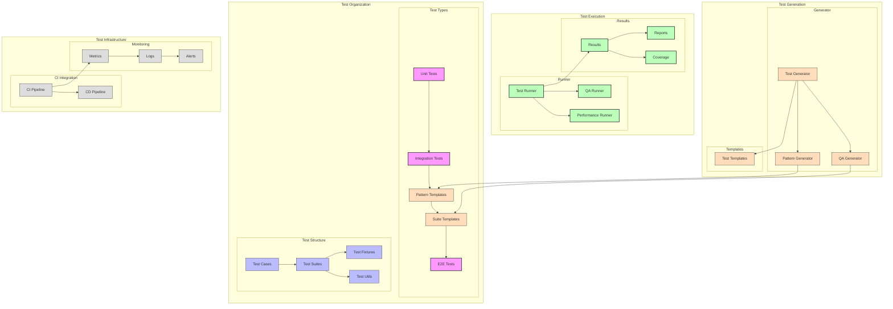

```mermaid
graph TB
    subgraph Test Organization
        subgraph Test Types
            UT[Unit Tests]
            IT[Integration Tests]
            PT[Performance Tests]
            ST[Security Tests]
            ET[E2E Tests]
            
            UT --> IT
            IT --> PT
            PT --> ST
            ST --> ET
        end
        
        subgraph Test Structure
            TC[Test Cases]
            TS[Test Suites]
            TF[Test Fixtures]
            TU[Test Utils]
            
            TC --> TS
            TS --> TF
            TS --> TU
        end
    end
    
    subgraph Test Execution
        subgraph Runner
            TR[Test Runner]
            QR[QA Runner]
            PR[Performance Runner]
            
            TR --> QR
            TR --> PR
        end
        
        subgraph Results
            RS[Results]
            RP[Reports]
            CV[Coverage]
            
            TR --> RS
            RS --> RP
            RS --> CV
        end
    end
    
    subgraph Test Generation
        subgraph Generator
            TG[Test Generator]
            QG[QA Generator]
            PG[Pattern Generator]
            
            TG --> QG
            TG --> PG
        end
        
        subgraph Templates
            TT[Test Templates]
            PT[Pattern Templates]
            ST[Suite Templates]
            
            TG --> TT
            PG --> PT
            QG --> ST
        end
    end
    
    subgraph Test Infrastructure
        subgraph CI Integration
            CI[CI Pipeline]
            CD[CD Pipeline]
            
            CI --> CD
        end
        
        subgraph Monitoring
            MT[Metrics]
            LG[Logs]
            AL[Alerts]
            
            CI --> MT
            MT --> LG
            LG --> AL
        end
    end
    
    classDef types fill:#f9f,stroke:#333,stroke-width:2px
    classDef structure fill:#bbf,stroke:#333,stroke-width:1px
    classDef execution fill:#bfb,stroke:#333,stroke-width:2px
    classDef generation fill:#fdb,stroke:#333,stroke-width:1px
    classDef infra fill:#ddd,stroke:#333,stroke-width:1px
    
    class UT,IT,PT,ST,ET types
    class TC,TS,TF,TU structure
    class TR,QR,PR,RS,RP,CV execution
    class TG,QG,PG,TT,PT,ST generation
    class CI,CD,MT,LG,AL infra
``` 