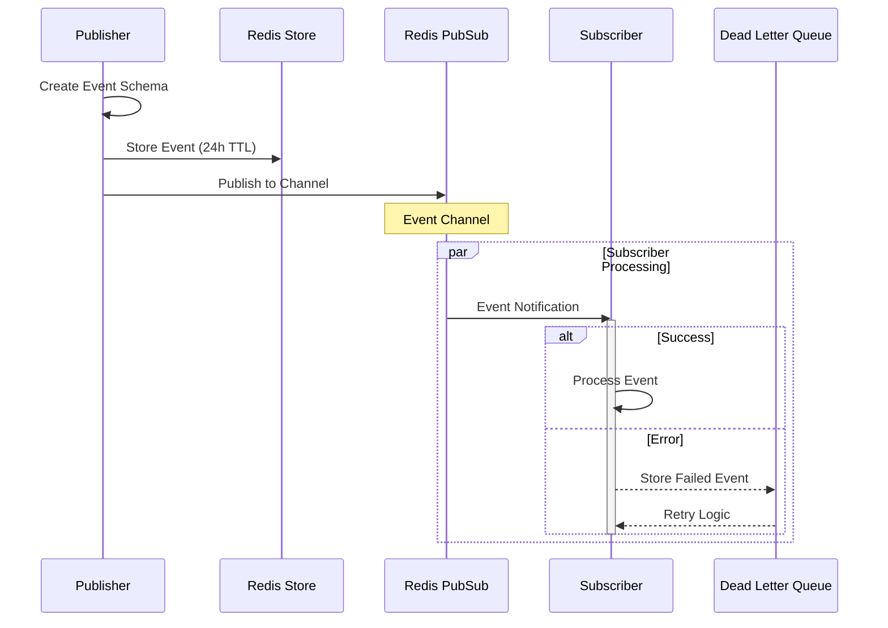
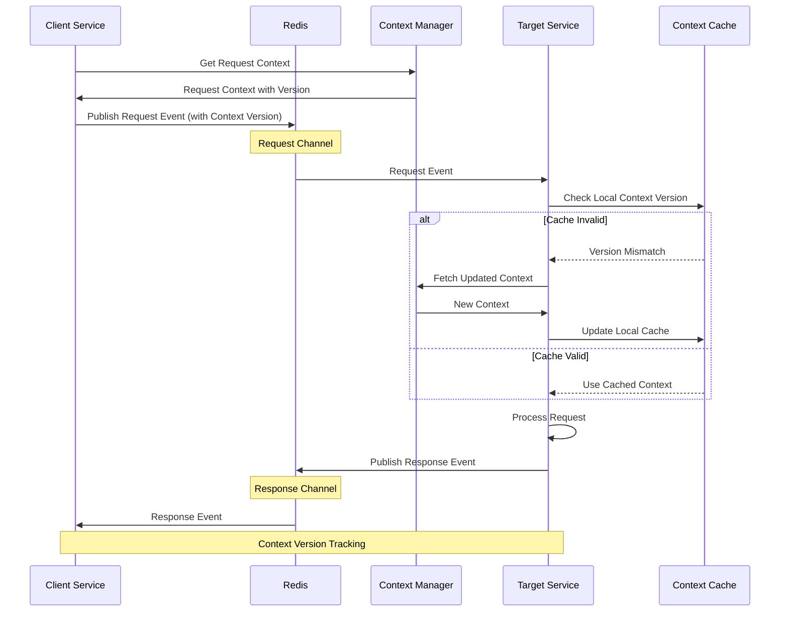
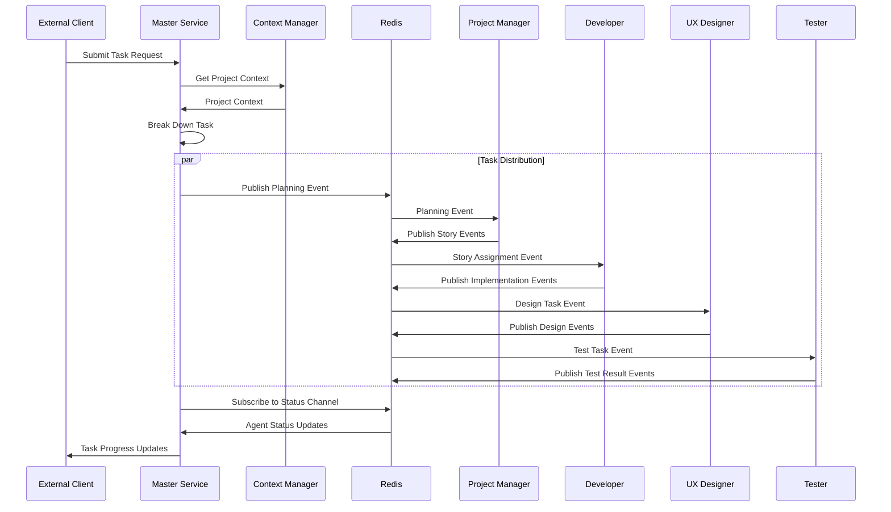
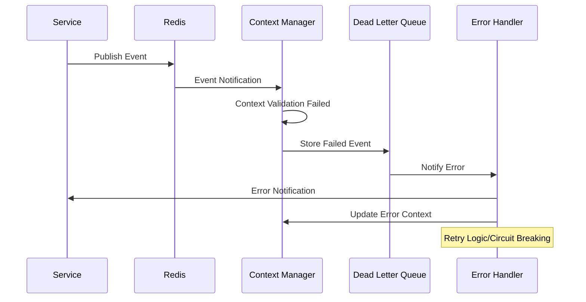
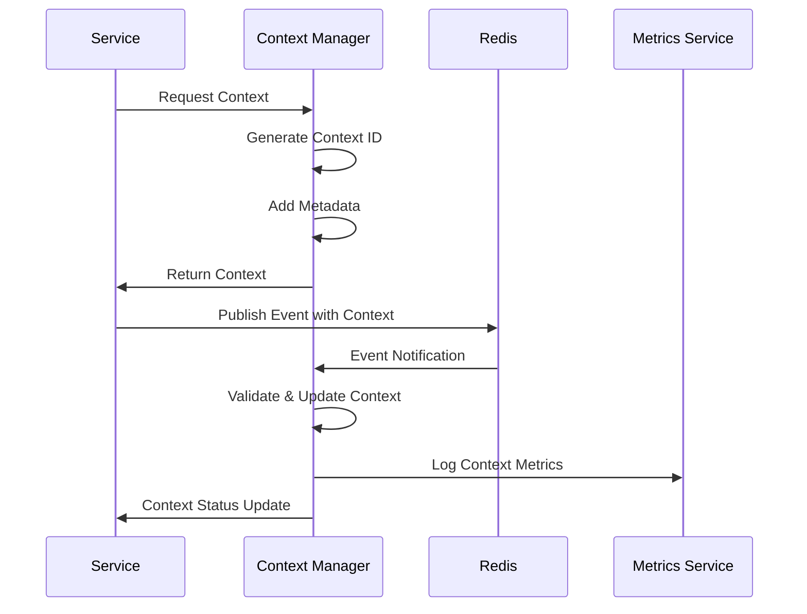
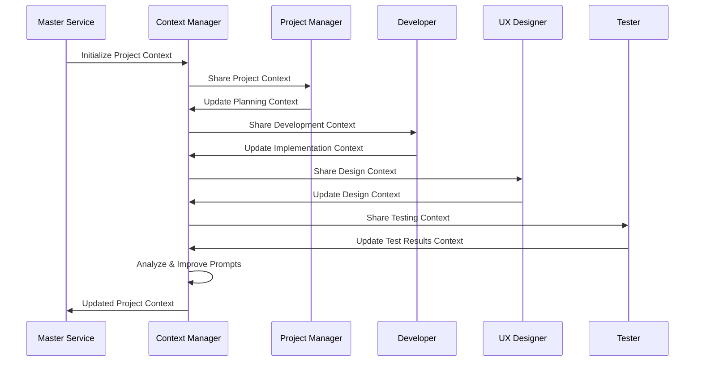

# Event System Flows

## Basic Event Publishing Flow

## Request-Response Pattern

## Task Coordination Flow

## Error Handling Flow

## Context Manager Interactions

## Project-wide Context Flow
