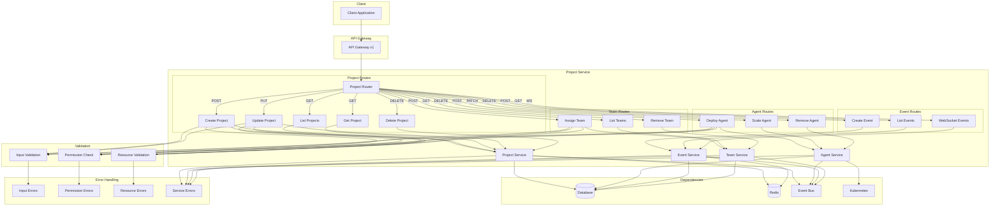

```mermaid
graph TB
    subgraph Client
        C[Client Application]
    end

    subgraph API Gateway
        AG[API Gateway v1]
    end

    subgraph Project Service
        PR[Project Router]
        PS[Project Service]
        AS[Agent Service]
        ES[Event Service]
        TS[Team Service]

        subgraph Project Routes
            PR --> |POST| PC[Create Project]
            PR --> |GET| PL[List Projects]
            PR --> |GET| PG[Get Project]
            PR --> |PUT| PU[Update Project]
            PR --> |DELETE| PD[Delete Project]
        end

        subgraph Agent Routes
            PR --> |POST| AD[Deploy Agent]
            PR --> |PATCH| ASC[Scale Agent]
            PR --> |DELETE| AR[Remove Agent]
        end

        subgraph Event Routes
            PR --> |POST| EC[Create Event]
            PR --> |GET| EL[List Events]
            PR --> |WS| EWS[WebSocket Events]
        end

        subgraph Team Routes
            PR --> |POST| TA[Assign Team]
            PR --> |GET| TL[List Teams]
            PR --> |DELETE| TR[Remove Team]
        end

        PC --> PS
        PL --> PS
        PG --> PS
        PU --> PS
        PD --> PS

        AD --> AS
        ASC --> AS
        AR --> AS

        EC --> ES
        EL --> ES
        EWS --> ES

        TA --> TS
        TL --> TS
        TR --> TS
    end

    subgraph Dependencies
        DB[(Database)]
        RD[(Redis)]
        EB[Event Bus]
        K8S[Kubernetes]
    end

    C --> AG
    AG --> PR

    PS --> DB
    PS --> RD
    PS --> EB

    AS --> K8S
    AS --> DB
    AS --> EB

    ES --> DB
    ES --> RD
    ES --> EB

    TS --> DB
    TS --> EB

    subgraph Validation
        V1[Input Validation]
        V2[Permission Check]
        V3[Resource Validation]
    end

    PC --> V1
    PC --> V2
    PC --> V3

    PU --> V1
    PU --> V2
    PU --> V3

    AD --> V1
    AD --> V2
    AD --> V3

    TA --> V1
    TA --> V2
    TA --> V3

    subgraph Error Handling
        E1[Input Errors]
        E2[Permission Errors]
        E3[Resource Errors]
        E4[Service Errors]
    end

    V1 --> E1
    V2 --> E2
    V3 --> E3
    PS --> E4
    AS --> E4
    ES --> E4
    TS --> E4
``` 