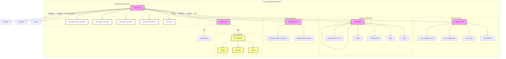

```mermaid
graph TB
    %% Class Definitions
    classDef model fill:#f9f,stroke:#333,stroke-width:2px
    classDef enum fill:#ff9,stroke:#333,stroke-width:2px
    classDef config fill:#9ff,stroke:#333,stroke-width:2px
    classDef method fill:#fff,stroke:#333,stroke-width:2px

    %% Team Configuration Domain
    subgraph TeamConfigDomain["Team Configuration Domain"]
        TC[TeamConfig]:::model
        SR[ServiceRole]:::enum
        PL[ProjectLimits]:::model
        RC[RoleConfig]:::model
        AC[AgentConfig]:::model
        TD[TeamDynamics]:::model

        %% Service Role Types
        subgraph ServiceRoles["Service Roles"]
            ADMIN[Admin]:::enum
            MEMBER[Member]:::enum
            VIEWER[Viewer]:::enum
            SR --> ADMIN
            SR --> MEMBER
            SR --> VIEWER
        end

        %% Project Limits
        subgraph ResourceLimits["Resource Limits"]
            MP[max_projects]
            MU[max_users]
            MS[max_storage_gb]
            MC[max_compute_units]
            PL --> MP
            PL --> MU
            PL --> MS
            PL --> MC
        end

        %% Team Configuration Structure
        TC --> |has|PL
        TC --> |contains|RC
        TC --> |configures|AC
        TC --> |defines|TD

        %% Role Configuration
        RC --> |type|SR
        RC --> |has|PERM[permissions]

        %% Agent Configuration
        subgraph AgentConfig["Agent Configuration"]
            AN[name]
            AT[type]
            AM[model_name]
            AE[events]
            AC[capabilities]
            AV[required_env_vars]
            AC --> AN
            AC --> AT
            AC --> AM
            AC --> AE
            AC --> AC
            AC --> AV
        end

        %% Team Dynamics
        subgraph TeamDynamics["Team Dynamics"]
            CP[collaboration_patterns]
            CC[communication_channels]
            TD --> CP
            TD --> CC
        end

        %% Loading Methods
        subgraph ConfigurationMethods["Configuration Methods"]
            FE[from_env]:::method
            LD[load_from_directory]:::method
            GAT[get_agent_by_type]:::method
            GATS[get_agents_by_type]:::method
            GAC[get_agents_by_capability]:::method
            
            TC --> FE
            TC --> LD
            TC --> GAT
            TC --> GATS
            TC --> GAC
        end
    end

    %% External Relationships
    TC --> |associated with|TEAM[Team]
    TC --> |manages|PROJ[Projects]
    TC --> |configures|AGENTS[Agents]
``` 